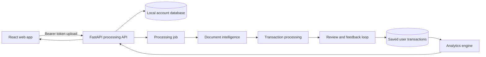

# FinSim architecture

FinSim is organized as one React frontend and four Python workspaces that share a transaction contract.

## Frontend

The frontend lives in `src/` and uses React, TypeScript, Vite, React Router, and custom CSS. It owns:

- Landing page and brand experience
- Sign up, sign in, local email verification, and sign out screens
- Dashboard, analytics, forecast, statements, and settings pages
- Statement upload progress UI
- Merchant review popup for uncertain categories
- Saved account analytics display

The frontend does not parse statements. It sends files to the API and polls the processing job.

## Processing API

The FastAPI app lives in `processing_api/`. It owns:

- Local account creation and verification
- Session token based authentication
- User scoped processing jobs
- PDF upload validation
- Job status, review items, feedback, and final result endpoints
- Saved merchant rules, statement batches, transactions, and account analytics

The local MVP stores account and transaction data in SQLite. Production should move this to managed PostgreSQL or another managed database.

## Document intelligence

The `document_intelligence/` workspace extracts normalized transaction rows from bank statement PDFs. It currently supports adapters for MidFirst, Discover, and Bank of America style statements, with tests for date inference, money parsing, statement reconciliation, and unknown layout rejection.

## Transaction processing

The `transaction_processing/` workspace cleans and categorizes extracted rows. It owns:

- Required CSV contract checks
- Merchant normalization
- Duplicate detection
- Category rulebook
- User feedback validation
- Remembered merchant rules
- Quality reports

The current approach is intentionally explainable. It should be measured before adding a heavier model.

## Analytics engine

The `analytics_engine/` workspace turns processed transactions into:

- Monthly summaries
- Category breakdowns
- Spending trends
- Anomaly candidates
- Next month forecast ranges

Money is serialized as strings so the frontend and API do not accidentally introduce floating point display errors.

## Shared transaction shape

| Field | Type | Purpose |
|---|---|---|
| `transaction_id` | string | Stable row identity |
| `posted_at` | ISO date | Bank posted date |
| `description_raw` | string | Original transaction description |
| `amount` | decimal string | Transaction amount |
| `transaction_type` | string | Debit or credit direction |
| `source_statement_id` | string | Statement traceability without exposing user file names |
| `merchant_clean` | string | Normalized merchant label |
| `category` | string | Current assigned category |
| `category_source` | string | Rule, bank category, feedback, or fallback source |
| `category_confidence` | decimal string | Confidence used for review routing |
| `review_flag` | boolean/string | Whether the row still needs attention |

## Security boundaries

- Users must be signed in before creating processing jobs.
- Jobs are scoped to the account that created them.
- Uploads require PDF extension, allowed content type, PDF signature, size limit, duplicate check, and consecutive month validation.
- Temporary statement workspaces are removed after processing.
- Local passwords are salted, hashed, and compared in constant time.
- CORS defaults to local development and must be explicitly configured for deployment.
- `.env`, local databases, raw inputs, outputs, builds, and dependency folders are ignored by Git.

## Production evolution

The controlled demo can run with local SQLite and synthetic or redacted statements. A real public version should add:

- Managed PostgreSQL
- Private encrypted object storage for raw statements
- Short retention jobs and user deletion controls
- Production email verification and password reset
- Rate limiting
- Monitoring and redacted logs
- Backups and restore testing
- Dependency and secret scanning in CI
