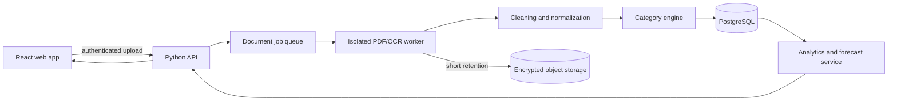

# How we expect FinSim to fit together

This is our working architecture, not a claim that every service already exists. Increment 1 gives each person a stable contract to build against. We can change the diagram later, but changes should be discussed before two workstreams start producing incompatible data.

The web app should never parse a statement itself. It sends an authenticated upload to the API, receives a job identifier, and checks the job until the result is ready. Parsing runs in an isolated worker because PDFs are untrusted input and can fail in unpleasant ways.

## The transaction shape we share

Before the parser, categorizer, analytics code, and frontend are connected, the team should agree on these fields:

| Field | Type | Why it is here |
|---|---|---|
| `transaction_id` | UUID/string | A stable idempotency key rather than a CSV row number |
| `account_id` | UUID/string | An internal, pseudonymous account reference |
| `posted_at` | ISO date | The date posted by the bank; keep a transaction date separately when available |
| `description_raw` | string | Original statement text with restricted access |
| `merchant_normalized` | string/null | A cleaned name suitable for the interface |
| `amount` | decimal string | Expenses are negative and credits are positive |
| `currency` | ISO 4217 | For example, `USD` |
| `category` | enum/string | A value from our versioned taxonomy |
| `category_confidence` | number/null | A score from 0 to 1; null when the user chooses the category |
| `source_statement_id` | UUID/string | Traceability without exposing the original filename |
| `pipeline_version` | string | Lets us reproduce and safely reprocess a result |

Money should use decimal arithmetic, never binary floating point. CSV is useful for debugging and passing early results between teammates, but it should not become the production database.

## Privacy and security decisions

- We will never ask for a user's bank username or password.
- Unsupported, malformed, encrypted, and oversized PDFs must fail safely.
- Uploaded files receive generated names and are stored outside the web root.
- Raw statements and cleaned transactions have separate access boundaries.
- Account numbers and raw descriptions never appear in application logs.
- Raw file retention is short, documented, and tied to the user's data deletion action.
- Parsing has CPU, memory, file size, and time limits.
- Git and CI use only synthetic or irreversibly redacted fixtures.

## Honest modeling rules

- Begin with understandable categorization rules and measure that baseline before adding a complex model.
- Evaluate forecasts by time; a random row split would leak information from the future.
- Show a range and its historical coverage instead of pretending one exact prediction is certain.
- Explain anomaly alerts using the amount, normal baseline, and signal that triggered them.
- Save user corrections together with the rule or model version that produced the original result.
