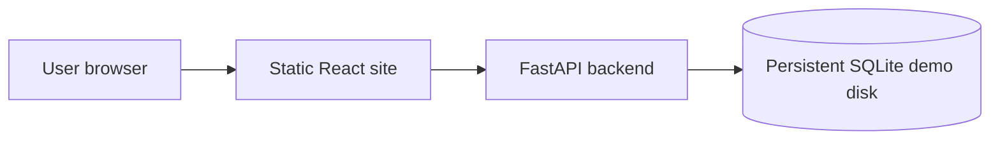
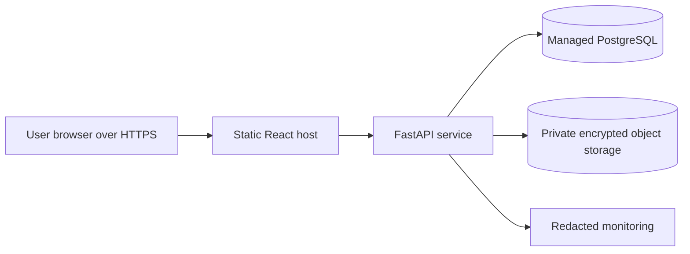

# Deployment guide

This guide describes a practical deployment path for the FinSim portfolio MVP. The project has two deployable parts:

- React frontend built with Vite
- FastAPI backend that runs the account and statement processing API

For a simple student portfolio deployment, use a static frontend host such as Vercel or Netlify, and a Python backend host such as Render, Railway, Fly.io, or a small VPS. For a more serious deployment, use a managed database and private object storage.

## Production readiness warning

The current app is good enough for a controlled demo with synthetic or redacted statements. It is not yet a full production financial product. Before accepting real user statements on the public internet, complete the items in [SECURITY.md](../SECURITY.md).

## Backend deployment settings

Set these environment variables on the backend host:

```text
FINSIM_ACCOUNT_DB=/var/data/finsim.db
FINSIM_CORS_ORIGINS=https://your-frontend-domain.example
```

Use a persistent disk or a managed database path for `FINSIM_ACCOUNT_DB`. If the host filesystem is ephemeral, accounts and saved transactions will disappear after redeploys.

Install command:

```bash
python -m pip install --upgrade pip
python -m pip install -e document_intelligence -e transaction_processing -e analytics_engine -e processing_api
```

Start command:

```bash
uvicorn finsim_api.app:app --app-dir processing_api/src --host 0.0.0.0 --port $PORT
```

If the host does not provide `$PORT`, use the port required by that platform.

## Frontend deployment settings

Set this environment variable on the frontend host:

```text
VITE_PROCESSING_API_URL=https://your-api-domain.example
```

Build command:

```bash
npm ci
npm run build
```

Publish directory:

```text
dist
```

## Manual deployment checklist

1. Merge the latest PR to `main`.
2. Pull `main` locally.
3. Run the full checklist in [docs/testing.md](testing.md).
4. Confirm `.env`, databases, statements, `dist`, and `node_modules` are not staged.
5. Deploy the backend.
6. Open the backend `/health` endpoint and confirm it returns `{"status":"ok"}`.
7. Deploy the frontend with `VITE_PROCESSING_API_URL` pointing to the backend URL.
8. Confirm the backend `FINSIM_CORS_ORIGINS` exactly matches the frontend origin.
9. Create a test account.
10. Upload three synthetic or redacted consecutive monthly statements.
11. Complete review prompts.
12. Confirm dashboard, analytics, and forecast pages show account data.

## Suggested first deployment architecture



This is acceptable for a controlled portfolio demo. The next production version should replace persistent SQLite with PostgreSQL and add private object storage for encrypted raw PDFs.

## Suggested production architecture



## Rollback

Keep the previous backend and frontend deploys available. If a release fails, roll back the frontend first, then the backend. If data migration is added later, every migration needs a tested rollback or backup restore plan.
